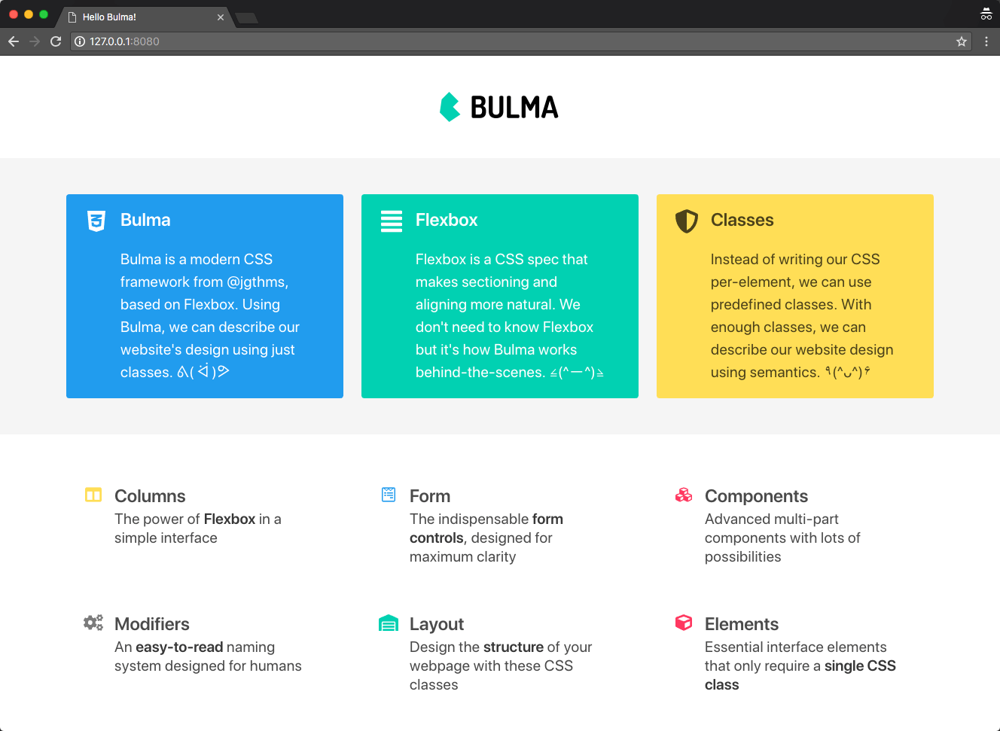
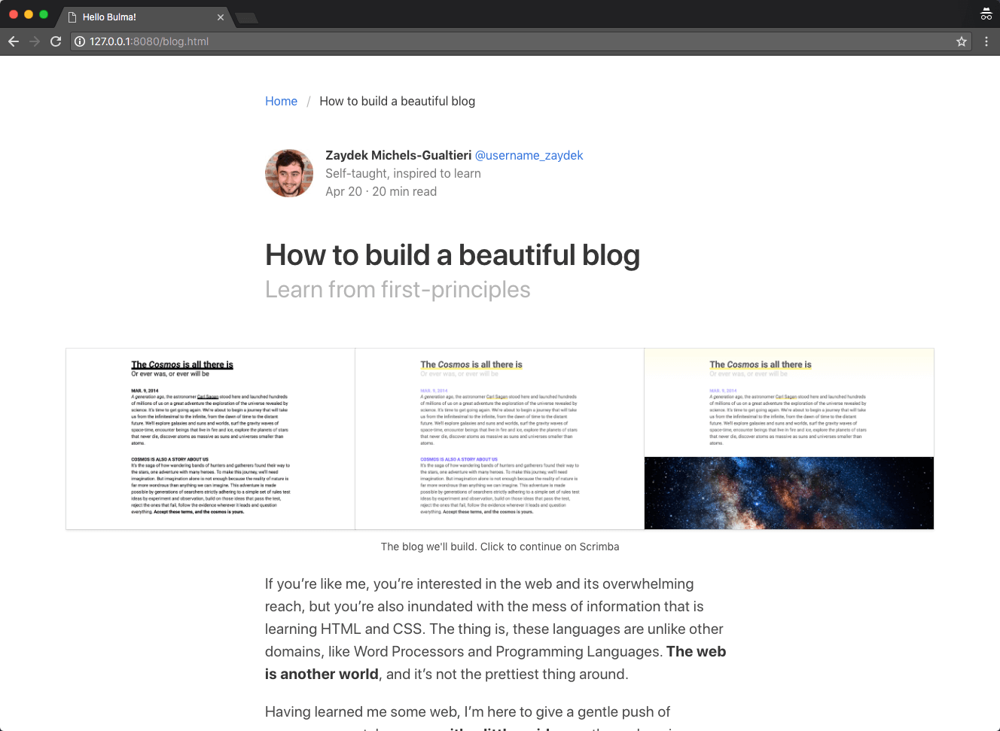
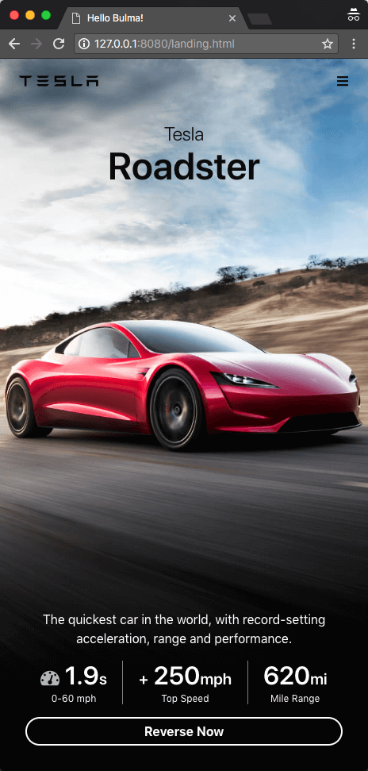
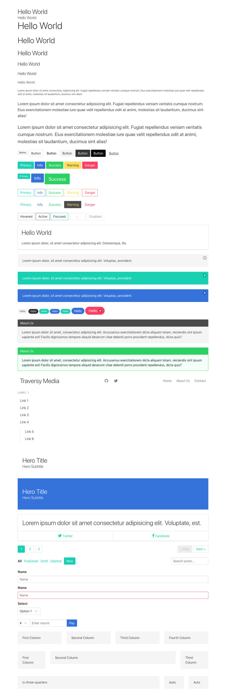

# Frontend Basic

Frontend basic knowledge about:

1. html
1. css
1. box model / flexbox / css grid
1. JavaScript / DOM API / jQuery
1. bootstrap

我的一些理解：

web 上实现 ui 是声明式的，html 和 css 都是声明式的。而 android 和 iOS 上自绘 view 是命令式的。

声明式的代码易于阅读和理解，但声明式隐藏了实现细节，实现细节在底层，不由自己掌控，不容易扩展，不灵活，但命令式允许自己掌控更多细节，容易扩展，更灵活，虽然实现可能会很麻烦。

[W3schools - HOW TO](https://www.w3schools.com/howto/default.asp) 这是个宝库啊，汇总了很多 ui 和交互的 html/css/js 实现，比如 checkbox 的自定义实现，Parallax Scrolling，各种 form 布局，drag element ...

## Notes

* HTML
  * [HTML](notes/html.md)
  * [HTML5](notes/html5.md)
* CSS
  * [CSS - 1](notes/css-1.md)
  * [CSS - 2](notes/css-2.md)
  * [《CSS 世界》笔记 1](notes/css-world-note-1.md)
  * [《CSS 世界》笔记 2](notes/css-world-note-2.md)
  * [CSS3](notes/css3.md)
  * [CSS3 FlexBox](notes/css3-flexbox.md)
  * [ReactNative FlexBox](notes/react-native-flexbox.md)
  * [CSS Grid](notes/css-grid.md)
  * [CSS 响应式 Web](notes/css-responsive.md)
  * [CSS Sike](notes/css-sike.md)
  * [CSS Misc](notes/css-misc.md)
  * [Color](notes/color.md)
* [JavaScript](notes/javascript-readme.md)
  * [JavaScript Basic](notes/javascript-basic.md)
  * [JavaScript BOM](notes/javascript-bom.md)
  * [JavaScript DOM](notes/javascript-dom.md)
  * [jQuery](notes/javascript-jquery.md)
* CSS Framework
  * [Bootstrap3 - 1](notes/bootstrap3-1.md)
  * [Bootstrap3 - 2](notes/bootstrap3-2.md)
  * [Bootstrap4](notes/bootstrap4.md)
  * [Bulma](notes/bulma.md)
* 其它
  * [数据可视化](notes/visualization-note.md)
  * [动画](notes/animation-note.md)

相关的其它项目：

- [JS Study](https://github.com/baurine/js-study)

  [JS Study](https://github.com/baurine/js-study) repo 更偏向于记录纯 js 相关，或与后端开发相关，或与 React/Vue 这些现代前端框架相关的内容。

  与 HTML/DOM/CSS 相关的内容记录在此 repo 中。

## Demos

1. [Profile Page](http://baurine.github.io/sike-css/)

   

1. Bulma Practice

   

   

   

   

   
