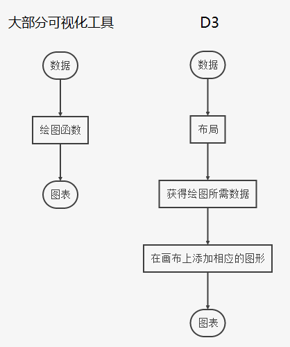

# D3 Study

D3.js，类似 SVG 中的 jQuery，同样拥有强大的选择器，链式调用。(D3.js 也可用于普通的 HTML DOM)

突然觉得 D3.js 的哲学思想和 Matlab 也有点相似啊，不需要使用循环而可以方便的批量操作数据和 SVG 元素。(jQuery 也有部分方法可以这样)

参考：

- [D3.js v5 版本入门教程](https://blog.csdn.net/qq_34414916/article/category/7608878)
- [D3.js v3 版本入门教程](http://wiki.jikexueyuan.com/project/d3wiki/)
- [Learn D3.js step by step](https://www.d3indepth.com/) - awesome!
- [D3.js 简介](https://github.com/ssthouse/ssthouse-blog/blob/master/d3-guide/d3_roadmap_cn.md)
- [D3.js 中文网站](https://d3js.org.cn/)

一些示例图的参考：

- [D3.js Tutorial: Building Interactive Bar Charts with JavaScript](https://blog.risingstack.com/d3-js-tutorial-bar-charts-with-javascript/)
- [D3.js 上手 - 饼状图](https://greenmzc.github.io/2016/11/07/D3-js%E4%B8%8A%E6%89%8B%E2%80%94%E2%80%94%E9%A5%BC%E7%8A%B6%E5%9B%BE/)
- [通过 D3.js 绘制一份中国分省地图](https://marshal.ohtly.com/2018/09/03/Drow-an-China-Map-With-D3-js/)
- [使用 d3 绘制中国地图](http://blog.tcs-y.com/2018/12/12/d3-china-map/)
- [D3.js 上手 - 折线图](https://greenmzc.github.io/2016/10/18/D3-js%E4%B8%8A%E6%89%8B%E2%80%94%E2%80%94%E6%8A%98%E7%BA%BF%E5%9B%BE/)
- [用 d3.js 实现基于 SVG 的线形图](http://www.alloyteam.com/2013/12/d3-line-chart/)
- [D3 examples search engine](https://blockbuilder.org/search)
- [The D3.js Graph Gallery](https://www.d3-graph-gallery.com/)
- [Observable](https://observablehq.com/@d3)

## D3.js 入门教程

- [D3.js v5 版本入门教程](https://blog.csdn.net/qq_34414916/article/category/7608878)
- [D3.js v3 版本入门教程](http://wiki.jikexueyuan.com/project/d3wiki/)

(这两个教程要结合着看，前者用了 v5 的 API，但写得太简单，后者用了过时的 v3 API，但解释得很清晰。)

目录：

- 第一章 — 如何在项目中使用 D3.js
- 第二章 — 第一个程序 Hello World
- 第三章 — 选择元素和绑定数据
- 第四章 — 理解 Update、Enter、Exit
- 第五章 — 选择、插入、删除元素
- 第六章 — 做一个简单的图表
- 第七章 — 比例尺的使用
- 第八章 — 坐标轴
- 第九章 — 完整的柱状图
- 第十章 — 让图表动起来
- 第十一章 — 交互式操作
- 第十二章 — 布局
- 第十三章 — 饼状图
- 第十四章 — 力导向图
- 第十五章 — 树状图
- 第十六章 — 中国地图

### 第一章 - 如何在项目中使用 D3.js

在 head 中导入 d3.v5.min.js

```html
<script src="http://d3js.org/d3.v5.min.js"></script>
```

### 第二章 — 第一个程序 Hello World

略。

```js
var p = d3.select('body').selectAll('p')
p.text('hello world').style('color', 'red')
```

- text() - 设置文本
- style() - 设置样式

### 第三章 — 选择元素和绑定数据

选择元素：

- select() - 选择符合条件的第一个元素
- selectAll() - 选择符合条件的所有元素

绑定数据：

- datum() - 将一个数据绑定到所有选择集上
- data() - 将一个数组绑定到选择集上，数组元素和选择集元素一一对应关系

### 第四章 — 理解 Update、Enter、Exit

在使用 data() 方法将数组和选择集进行绑定时，存在两者长度不匹配的情况。

- 长度的交集部分称为 update
- 如果数组长度大于选择集长度，D3 可以创建新的 DOM 元素来和数组剩余数据进行匹配，这部分称为 Enter
- 如果数组长度小于选择集长度，那么有一些 DOM 元素就没有数据与之匹配，这部分称为 Exit

通过，对于 Enter 部分，我们选择使用 append() 方法来填充 DOM 元素，对于 Exit 部分，我们选择 remove() 方法来移除多余的 DOM 元素。

示例图：


update 和 enter 示例代码：

```html
<body>
  <p>dog</p>
  <p>cat</p>
  <p>pig</p>

  <script>
    var dataset = [3, 6, 9, 12, 15]
    var p = d3.select('body').selectAll('p')
    var update = p.data(dataset) // 绑定数据, 并得到 update 部分
    var enter = update.enter() // 得到 enter 部分
    // 下面检验是否真的得到
    // 对于 update 的处理
    update.text(function(d, i) {
      return 'update:' + d + ',index:' + i
    })
    // 对于 enter 的处理
    // 注意，这里需要先添加足够多的 <p>，然后在添加文本
    var pEnter = enter.append('p') // 添加足够多的 <p>
    pEnter.text(function(d, i) {
      return 'enter: ' + d + ',index: ' + i
    })
  </script>
</body>
```

update 和 exit 示例代码：

```html
<body>
  <p>dog</p>
  <p>cat</p>
  <p>pig</p>
  <p>rat</p>

  <script>
    var dataset = [3, 6]
    var p = d3.select('body').selectAll('p')
    var update = p.data(dataset) // 绑定数据, 并得到 update 部分
    var exit = update.exit() // 得到 exit 部分
    // 下面检验是否真的得到
    // 对于 update 的处理
    update.text(function(d, i) {
      return 'update:' + d + ',index:' + i
    })
    // 对于 exit 的处理通常是删除 ，但在这里我并没有这么做
    exit.text(function(d, i) {
      return 'exit'
    })
  </script>
</body>
```

### 第五章 — 选择、插入、删除元素

- 选择
  - select()
  - selectAll()
- 插入
  - append() - 在父元素中插入子元素
  - insert() - 在兄弟元素前面插入元素
- 删除
  - remove()

### 第六章 — 做一个简单的图表

在 svg 上用 rect 画矩形，设置它的 x, y, width, height, fill 属性。

核心代码：

```html
<body>
  <svg width="960" height="600"></svg>
  <script>
    var margin = { top: 60, right: 60, bottom: 60, left: 60 }
    var dataset = [250, 210, 170, 130, 90]

    var svg = d3.select('svg')
    var g = svg
      .append('g')
      .attr('transform', `translate(${margin.top}, ${margin.left})`)

    var rectHeight = 30
    g.selectAll('rect')
      .data(dataset)
      .enter()
      .append('rect')
      .attr('x', 20)
      .attr('y', function(d, i) {
        return i * rectHeight
      })
      .attr('width', function(d, i) {
        return d
      })
      .attr('height', function(d, i) {
        return rectHeight - 5
      })
      .attr('fill', 'blue')
  </script>
</body>
```

`g.selectAll('rect').data(dataset).enter().append('rect')` 在第四章已经解释了，这里表示填充不足的 rect 元素。(不过我表示好奇，如果 selectAll 和 append 的元素类型不相同会怎么样，待试验。- 经过测试发现也是可以的，也不会报 warning)

绘制图表，主要就是设置好坐标系，必要时还需要设置坐标系的比例，然后设置好各个形状的尺寸。

### 第七章 — 比例尺的使用

比例尺 (scale)：将某一区域的值映射到另一区域，其大小关系不变。

对于一个一元二次函数，有 x 和 y 两个未知数，当 x 的值确定时，y 的值也就确定了。

在数学中，x 的范围被称为定义域，y 的范围被称为值域。

D3 中的比例尺，也有定义域和值域，分别被称为 domain 和 range。开发者需要指定 domain 和 range 的范围，如此即可得到一个计算关系。

D3 中两种常用的比例尺：

- 线性比例尺 - d3.scaleLinear()，按比例
- 序数比例尺 - d3.scaleOrdinal()，一一对应，有点枚举的意思，用于 domain 和 range 为离散值，即非连续值

使用示例：

```js
// scaleLinear
var dataset = [1.2, 2.3, 0.9, 1.5, 3.3]
var min = d3.min(dataset)
var max = d3.max(dataset)
var scaleLinear = d3
  .scaleLinear()
  .domain([min, max])
  .range([0, 300])
document.write('scaleLinear(0.9): ', scaleLinear(0.9)) // output: 0
document.write('scaleLinear(3.3): ', scaleLinear(3.3)) // output: 300

// scaleOrdinal
var index = [0, 1, 2, 3, 4]
var color = ['red', 'blue', 'yellow', 'black', 'green']
var scaleOrdinal = d3
  .scaleOrdinal()
  .domain(index)
  .range(color)
document.write('scaleOrdinal(1) 输出：' + scaleOrdinal(1)) // blue
```

### 第八章 — 坐标轴

D3 中没有现成的坐标轴图形，需要我们自己用其他组件拼凑而成。D3 中提供了坐标轴组件，使得我们在 SVG 中绘制一个坐标轴变得像添加一个普通元素那样简单。

关键函数：call()。首先利用 D3 提供的坐标轴函数构造出一个坐标轴，然后选择 SVG DOM 元素，在 DOM 元素上调用 call(axis)。

用 call() 是为了维持链式调用，实际 `selection.call(axis)` 等于 `axis(selection)`。

在第六章的简单柱状图基础上加上一个 x 轴，示例代码：

```js
// 定义一个坐标轴 - x 轴
var xAxis = d3.axisBottom(scaleLinear).ticks(7)
// 将 x 轴添加到 <g> 中
g.append('g')
  .attr('transform', `translate(20, ${dataset.length * rectHeight})`)
  .call(xAxis)
```

上面的代码等价于 `xAxis(g.append('g').attr(...))`。

我发现 SVG 中的这个 `<g>` 标签有点类似 html 中的 `<div>` 标签。

### 第九章 — 完整的柱状图

一个完整的柱状图，包括 x 轴，y 轴，柱状，文字。

相比第八章需要多使用两个 API:

- d3.scaleBand() - 也算序数比例尺的一种
- d3.rangeRound() - 返回一个等差数列

关于 D3 中常用的比例尺，可以参看这篇文章 - [D3 中常用的比例尺](https://segmentfault.com/a/1190000011006780)

示例：

```js
var xScale = d3
  .scaleBand()
  .domain(d3.range(dataset.length))
  .rangeRound([0, width - margin.left - margin.right])
var xAxis = d3.axisBottom(xScale)

// x 轴
g.append('g')
  .attr('transform', `translate(0, ${height - margin.top - margin.bottom})`)
  .call(xAxis)
```

### 第十章 — 让图表动起来

给 SVG 添加动画。动画的套路都是这样：

1. 设置初始状态及结束状态
1. 设置动画持续时间 (duration) 及开始时间 (delay)
1. 设置过渡方式 (ease)
1. 设置重复次数或者是否反转

D3 中相关的 API:

- `.attr(xxx).transition().attr(yyy)` - 使用 transition() 添加过渡动画，从 xxx 状态过渡到 yyy
- `.duration(2000)` - 动画持续时间
- `.delay(500)` - 动画开始时间，这里表示延迟 0.5s 后开始
- `.ease(d3.easeElasticInOut)` - 过渡方式

给第九章中的柱状矩形添加动画，示例代码如下，对 y 和 height 属性进行了过渡动画：

```js
// bar
var rectPadding = 20
gs.append('rect')
  .attr('x', function(d, i) {
    return xScale(i) + rectPadding / 2
  })
  .attr('y', function(d, i) {
    // 初始状态
    var min = yScale.domain()[0]
    return yScale(min)
  })
  .attr('width', function(d, i) {
    return xScale.step() - rectPadding
  })
  .attr('height', function(d, i) {
    // 初始状态
    return 0
  })
  .attr('fill', 'blue')
  .transition()
  .duration(2000)
  .delay(function(d, i) {
    return i * 400
  })
  // .ease(d3.easeElasticInOut)
  .attr('y', function(d, i) {
    // 回到最终状态
    return yScale(d)
  })
  .attr('height', function(d, i) {
    // 回到最终状态
    return height - margin.top - margin.bottom - yScale(d)
  })
```

(写法有点啰嗦啊...)

### 第十一章 — 交互式操作

和 HTML DOM 处理交互事件一样的方法，使用 `on(eventType, handler)`。事件类型也和 DOM 一样：click, dbclick, mouseover, mouseout, mousemove, mousedown, mouseup ...

为柱状图添加鼠标滑过的事件处理：

```js
gs.append('rect')
  .attr('x', function(d, i) {
    return xScale(i) + rectPadding / 2
  })
  .attr('y', function(d, i) {
    return yScale(d)
  })
  .attr('width', function(d, i) {
    return xScale.step() - rectPadding
  })
  .attr('height', function(d, i) {
    return height - margin.top - margin.bottom - yScale(d)
  })
  .attr('fill', 'blue')
  .on('mouseover', function() {
    d3.select(this)
      .transition()
      .duration(1000)
      .attr('fill', 'yellow')
  })
  .on('mouseout', function() {
    d3.select(this)
      .transition()
      .duration(1000)
      .delay(1000)
      .attr('fill', 'blue')
  })
```

当鼠标滑过当前 rect 时，将填充颜色过渡为 yellow，滑出后再过渡回 blue。

### 第十二章 — 布局

布局，可以理解成 “制作常见图形的函数”，有了它制作各种相对复杂的图表就方便多了。

(布局这个名字取得真不咋的...其实是用来进行数据转换的函数)



如何理解布局：将不适合用于绘图的数据转换成了适合用于绘图的数据。本教程将布局的作用解释成：数据转换。

> 布局不是要直接绘图，而是为了得到绘图所需的数据。

> D3 总共提供了 12 个布局：饼状图（Pie）、力导向图（Force）、弦图（Chord）、树状图（Tree）、集群图（Cluster）、捆图（Bundle）、打包图（Pack）、直方图（Histogram）、分区图（Partition）、堆栈图（Stack）、矩阵树图（Treemap）、层级图（Hierarchy）。

> 12 个布局中，层级图（Hierarchy）不能直接使用。集群图、打包图、分区图、树状图、矩阵树图是由层级图扩展来的。如此一来，能够使用的布局是 11 个（有 5 个是由层级图扩展而来）。这些布局的作用都是将某种数据转换成另一种数据，而转换后的数据是利于可视化的。

(那有第三方布局吗？应该要有的吧，不然怎么扩展...其实布局就是一些数据转换函数而已，没有的话就自己实现喽)

### 第十三章 — 饼状图

- [D3.js 上手 - 饼状图](https://greenmzc.github.io/2016/11/07/D3-js%E4%B8%8A%E6%89%8B%E2%80%94%E2%80%94%E9%A5%BC%E7%8A%B6%E5%9B%BE/)

将类似 `var dataset = [ 30 , 10 , 43 , 55 , 13 ];` 绘制成饼图，直接拿这样的数据是不能绘制的，因为缺少绘制弧形所需的角度等数值，所以我们需要用到布局将其转换成适合绘制弧形的数据。

转换：

```js
// 定义布局
var pie = d3.pie()
// 转换
var pieData = pie(dataset)
console.log(pieData)
// 将 pieData 和选择集进行绑定
var gs = g
  .selectAll('.g')
  .data(pieData)
  .enter()
  .append('g')
  .attr('transform', `translate(${width / 2},${height / 2})`)
```

通过转换得到的 pieData 中就有了角度等信息，可以用来绘制弧形了：

```
Array(5)
  0:
    data: 30
    endAngle: 5.3261438365495835
    index: 2
    padAngle: 0
    startAngle: 4.077828874858275
    value: 30
```

为了将 pieData 中的数据生成对应的弧形，即得到 path 元素中的 d 属性值，还需要借助弧形生成器函数。

```js
// 新建一个弧形生成器
var arcGenerator = d3
  .arc()
  .innerRadius(0)
  .outerRadius(100)
// ...
// 绘制扇形
gs.append('path')
  .attr('d', function(d, i) {
    return arcGenerator(d)
  })
  .attr('fill', function(d, i) {
    return colorScale(i)
  })
```

总结绘制饼状图所需 API：

- d3.pie(dataset) - 将原始数组生成绘制饼状图所需数组，用于和 SVG 元素进行绑定
- d3.arc().innerRadius(radius).outerRadiu(radius) - 弧形生成器
- d3.arc().centroid() - 弧形中心位置，用来绘制文本时所需坐标的方法
- d3.schemeCategory10 - 颜色

### 第十四章 — 力导向图

(看了 v3 版的教程好理解多了，先暂时跳过，需要时再看)

绘制力导向图所需的 API：

- d3.forceSimulation() - 新建一个力导向图
- d3.forceSimulation().force() - 添加或移除一个力
- d3.forceSimulation().nodes() - 对输入的数组进行一定的数据转换
- d3.forceLink().links() - 输入也是一个数组 (边集)，对这个输入的边集进行转换
- tick() - ??
- d3.drag() - 力导向图可以被拖动

暂时不是很理解，需要时再仔细看。

### 第十五章 — 树状图

先跳过，需要时再消化。需要了解许多新的 API。

### 第十六章 — 中国地图

- [通过 D3.js 绘制一份中国分省地图](https://marshal.ohtly.com/2018/09/03/Drow-an-China-Map-With-D3-js/)
- [使用 d3 绘制中国地图](http://blog.tcs-y.com/2018/12/12/d3-china-map/)

绘制地图需要特别的描述地理坐标的 JSON 文件，称为 GeoJSON。

主要原理其实简单，加载 json 文件中的数据，然后使用 d3 中的数据转换 api 进行转换，然后使用 path 进行绘制和填充即可。关键在于数据的转换这一步，也可以说是 d3 绘制所有图形中最关键的一步。

首先看数据转换部分的逻辑，由于 geojson 中的数据是经纬度，是三维的，需要转换成网页上显示的二维数据，所以需要设置一个投影函数来转换经纬度，使用常用的墨卡托投影函数 - `d3.geoMercator()`。

```js
// 数据转换器
// 投影函数，将经纬度转换成二维数据
var projection = d3
  .geoMercator()
  .center([104, 38]) // 设置地图中心位置，[104, 38] 表示经纬度
  .scale(500) // 放大比例
  .translate([width / 2, height / 2])
// 地理路径生成器
var path = d3.geoPath().projection(projection)
```

如果所有省用统一颜色绘制：

```js
// 加载 json，绘制 path
d3.json('data/china.geojson').then(geojson => {
  // 所有省用统一颜色绘制
  g.append('path')
    .attr('d', path(geojson))
    .attr('fill', 'Lavender')
    .attr('stroke', 'DarkGrey')
    .attr('stroke-width', 1)
})
```

如果每个省用不同的颜色绘制，那么每个省用一个 path 绘制，每个省填充不同的颜色：

```js
// 加载 json，绘制 path
d3.json('data/china.geojson').then(geojson => {
  // 分省绘制，每个省用不同颜色
  g.selectAll('path')
    .data(geojson.features)
    .enter()
    .append('path')
    .attr('d', function(d, i) {
      return path(d)
    })
    .attr('stroke', 'DarkGrey')
    .attr('stroke-width', 1)
    .attr('fill', function(d, i) {
      return colorScale(i)
    })
    .on('mouseover', function(d, i) {
      d3.select(this).attr('fill', 'yellow')
    })
    .on('mouseout', function(d, i) {
      d3.select(this).attr('fill', colorScale(i))
    })
})
```

## Misc

### D3 API

- [API](https://github.com/d3/d3/blob/master/API.md)
- [Observable](https://observablehq.com/@d3)
- [D3 is not a Data Visualization Library](https://medium.com/@Elijah_Meeks/d3-is-not-a-data-visualization-library-67ba549e8520)

D3.js 可以作为一个整体使用，但体积会比较大，D3.js 把它的代码拆成了很多个 (三十一个) 小的功能库，如果只需要它的一部分功能，可以单独导入此功能的库，比如 d3-color, d3-scale-chromatic ... (loadash 也是类似的分包策略) 每个子库的演示可以到 [Observable](https://observablehq.com/@d3) 上观看。

最重要的几个库：d3-select, d3-scale ...

[D3 is not a Data Visualization Library](https://medium.com/@Elijah_Meeks/d3-is-not-a-data-visualization-library-67ba549e8520) 这篇文章将 D3 的所有功能库作了一些分类并进行了讲解，帮助理解这些功能库。

### 绘制折线图

- [D3.js 上手 - 折线图](https://greenmzc.github.io/2016/10/18/D3-js%E4%B8%8A%E6%89%8B%E2%80%94%E2%80%94%E6%8A%98%E7%BA%BF%E5%9B%BE/)
- [用 d3.js 实现基于 SVG 的线形图](http://www.alloyteam.com/2013/12/d3-line-chart/)

实现代码见 misc-1-line-chart.html。

上面的教程都是基于 D3 v3 版本的，v5 版本中，让折线平滑的方法是 `curve(d3.curveCardinal)`。

另外在绘制折线和 dot 时，要先把坐标原点设置在 `(padding.left, padding.top)`。

### 简单热力图

像 GitHub contribution 那种简单的热力图，而不是用 heatmap.js 绘制的复杂热力图。

- [Heatmap with data update](https://blockbuilder.org/zhouliwang/7864f974a34ec9230835163721d8c158)
