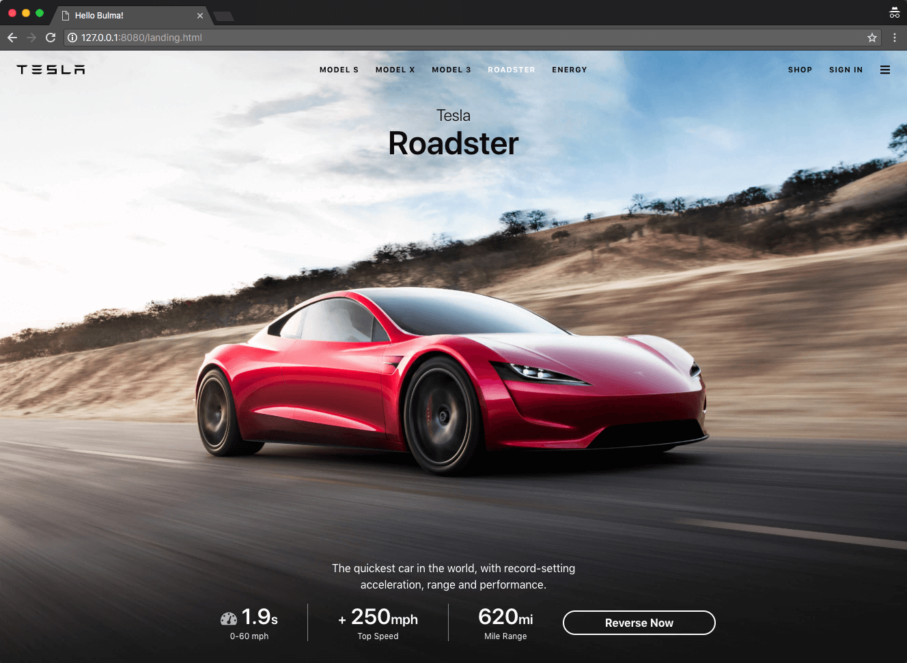
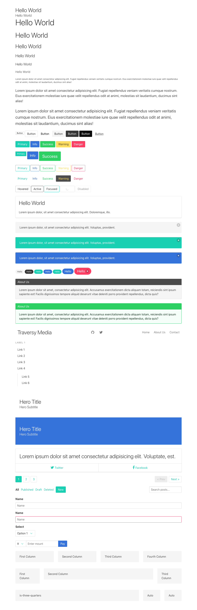

# Bulma

[Bulma](https://bulma.io/) 是一个轻量级的纯 CSS 框架，基于 FlexBox，相比 Bootstrap，没有 JavaScript 代码，更不用依赖 jQuery。所以在 React/Vue 这种不推荐使用 jQuery 的项目中，可以考虑使用。简单学习了解。

## 参考

1. [Documentation](https://bulma.io/documentation/)
1. [Video - Learn Bulma CSS for free](https://scrimba.com/g/gbulma)
1. [Video - Bulma CSS Framework Crash Course](https://www.youtube.com/watch?v=IiPQYQT2-wg)
1. [CSS 框架 Bulma 教程](http://www.ruanyifeng.com/blog/2017/10/bulma.html)

## Video - Learn Bulma CSS for free

这个 tutorial 还是需要你对 Bulma 有一些基本的了解才能吸引得比较好。

演示了三个 Demo：slide page，blog page，landing page。

这个 tutorial 还在案例中使用了 CSS Grid，可以说是比较 fashion 了。

学习到了一些常用的 classes：

关于布局：

1. hero / hero-head / hero-body / hero-footer
1. section / container
1. columns / column

关于颜色：

1. has-background-light
1. is-primary, is-warning, is-info

关于大小尺寸：

1. is-size-5, is-5 (暂不清楚二者区别)
1. is-fullheight
1. is-one-third
1. is-medium, is-large

关于文本：

1. title, subtitle
1. has-text-danger

关于 media：

1. media, media-left, media-content

还是需要把 Bulma 的文档整体再过一遍。

当使用 CSS Framework 时，得按照它们的规则来进行布局，比如 column class 必须得在 class 为 columns 的容器中使用，container class 一般在 class 为 section 的容器中使用。

最后的 Demo：

## Video - Bulma CSS Framework Crash Course

感觉这个视频教程比上一个还好一点，简洁明了地演示了常用功能的使用。

介绍了以下几大模块以及常用的 class。

- Heading / Size
  - .title, .subtitle
  - .is-1, .is-2, .is-3 ...

- Content
  - .content
  - .is-small, .is-medium, .is-large

- Button
  - .button
  - .is-white, .is-light, .is-black, .is-dark, .is-link
  - .is-primary, .is-info, .is-success, .is-warning, .is-danger
  - .is-outlined, .is-inverted
  - .is-hovered, .is-active, .is-focused. .is-loading

- Box
  - .box

- Notification
  - .notification
  - button.delete

- Tag
  - .tag

- Message
  - .message
  - .message-header, .message-body

- NavBar
  - .nav
  - .nav-left, .nav-center, .nav-right
  - .nav-item

- Side Menu
  - .menu
  - .menu-label, .menu-list

- Hero
  - .hero
  - .hero-header, .hero-body, .hero-footer

- Card
  - .card
  - .card-content, .card-footer
  - .card-footer-item

- Pagination
  - .pagination
  - .pagination-previous, .pagination-next
  - .pagination-list
  - .pagination-link
  - .is-current

- Level
  - .level
  - .level-left, .level-right
  - .level-item

- Form
  - .field, .has-addons
  - .control
  - label.label, .select, input.input

- Grid System
  - .columns
  - .column
  - is-2, is-8 ...
  - is-two-thirds, is-three-quarters ...

从上可知，is-1, is-2, is-8 ... 这类的 class，在不同的场景中有不同的意义，当它们和 title/subtitle 一起用时，这些 class 表示文本的尺寸，当它们和 column 一起用时，表示此例在整行中所占的比例。以 is-2 为例，即：

    .title.is-2 {
      font-size: 2.5rem;
    }

    .column.is-2 {
      flex: none;
      width: 16.66667%;
    }

而 .is-size-5 这类 class 则永远只用来表示文本尺寸。

最后的效果：

## Documentation

最后再把官方文档简单浏览一遍。分几大模块：

- Overview
- Modifiers
- Columns
- Layout
- Form
- Elements
- Components

就按照这个顺序一个一个来吧。

### Overview

- Getting Started (skip)
- Customize (skip)
- CSS Classes (skip)
- Modularity
- Responsiveness
- Variables
- Colors
- Functions
- Mixins

#### Modularity

是说 bulma 支持模块化，你可以只导入 bulma 的部分 css，不用全部导入，如果你保需要它的 button 相关的 classes，就只导入 button 相关的 css，比如 `@import "bulma/sass/elements/button.sass"`。

#### Responsiveness

响应式，Bulma mobile 优先，布局默认垂直。比如 `columns/level` class，而它们在 desktop 上是水平布局的。`nav` class 在 mobile 上是 hidden 的。

除了 mobile 是默认垂直布局外，其余都是水平布局，所以如果你在 class 中加入 `is-mobile` modifier，则表示 mobile 也使用水平布局。(有待进一步确认?)

5 个 breakpoints:

- mobile: <= 678px
- tablet: >= 769px
- desktop: >= 1024px
- widescreen: >= 1216px
- fullhd: >= 1408px

#### Variables

使用到的所有变量的值，比如 `.is-primary` 中用到的 `$primary` 的值，`.is-info` 中用到的 `$info` 的值，等等。如果你需要 customize，就可以通过修改这些变量值来实现。

#### Colors

Bulma 中用到的常见的颜色值。

#### Functions

提供的一些工具方法，只有三个，用来定义动态的尺寸和颜色，暂略。

#### Mixins

好像是你可以在 sass 中使用的一些 helper 方法，比如：

- `=arrow($color)` - 	Creates a CSS-only down arrow. Used for the dropdown select.
- `=clearfix`	Adds a clearfix at the end of the element. Used for the "is-clearfix" helper.
- ...

### Modifier

修饰器，以 `is-` 或 `has-` 开头的 classes，一般用来和其它 classes 配合使用，不单独使用，可以同时附加多个属性不冲突的修饰器。

- Syntax
- Helpers
- Responsive helpers
- Color helpers
- Typography helpers

#### Syntax

如上所言，以 `is-` 或 `has-` 开头的 classes。

- 颜色：is-primary, is-link, is-info, is-success, is-warning, is-danger
- 尺寸：is-small, is-medium, is-large
- style or state: is-outlined, is-loading, [disabled]

#### Helpers

- Float
  - is-clearfix
  - is-pulled-left / is-pulled-right

- Spacing
  - is-marginless / is-paddingless

- Other
  - is-overlay
  - is-clipped
  - is-radiusless

#### Responsive Helperes

is-flex-mobile, is-flex-tablet-only ... 暂略，暂不明白怎么使用。

#### Color Helpers

- 文本颜色：has-text-white, has-text-black, has-text-light, has-text-dark, has-text-primary, has-text-grey ...
- 背景颜色：has-background-white, has-background-black ...

`has-` 系列和 `is-` (比如 `is-primary`) 系列的区别，`has-` 单指前景色或背景色，而 `is-` 同时包括了前景色和背景色的值。

#### Typography Helpers

- Size:
  - is-size-1 (font-size: 3rem)
  - is-size-2 (font-size: 2.5rem)
  - ...
  - is-size-6 (1rem)

- Responsive size
  - is-size-1-mobile: 表示仅在 mobile 是 font-size 是 3rem，其余屏幕上 font-size 不变化
  - is-size-1-tablet
  - ...

- Colors
  - has-text-white, has-text-black ...

- Alignment
  - has-text-centered
  - has-text-justified
  - has-text-left
  - has-text-right

- Responsive alignment
  - has-text-left-mobile ...

- Text transformation
  - is-capitalized, is-lowercase, is-uppercase, is-italic

- Text weight
  - has-text-weight-light/normal/semibold/bold

### Columns

- Basics
- Sizes
- Responsiveness
- Nesting
- Gap
- Options

最基本的用法，columns class 作为容器，里面放置 column class。默认每一个 column 等宽分配。

Size: is-three-quarters, is-one-third, is-half ...

12 列的网络系统：is-1, is-2, ... is-11

is-1 表示占据 1/12 的宽度，is-2 表示占据 2/12 的宽度，依此类推。

offset: is-offset-1, ...is-offset-11

narrow column: "column is-narrow"，is-narrow class 使此列的宽度取决于内容或 style 中指定的宽度。

#### Responsiveness

columns 默认只在 tablet 及以上生效，在 mobile 上是堆叠在一起的，如果想在 mobile 上也生效，则在 columns class 后加上 is-mobile class。

    

如果想让 columns 仅在 desktop 上生效，则加上 is-desktop class。

    

> By default, columns are only activated from **tablet** onwards. This means columns are stacked on top of each other on mobile.
If you want columns to work on mobile too, just add the `is-mobile` modifier on the `columns` container.

> If you _only_ want columns on **desktop** upwards, just use the `is-desktop` modifier on the `columns` container.

可以给一列指定在不同屏幕尺寸上占据不同宽度。

    

      

        <code>is-three-quarters-mobile</code> 
        <code>is-two-thirds-tablet</code> 
        <code>is-half-desktop</code>
        <code>is-one-third-widescreen</code>
        <code>is-one-quarter-fullhd</code>
      

      
1

      
1

    

#### Nesting

支持 columns 中嵌套 columns

#### Gap

默认 column 之间的 gap 是 0.75rem，通过在 columns class 后加上 is-gapless 修饰器来消除 gap。也可以通过 is-0 ... is-8 来修改 gap。

is-multiline 修饰器支持在 columns 中显示多行。

#### Options

is-centered 修饰器作用于 columns class，使 column 中的元素居中对齐。

### Layout

Container / Level / Media Object / Hero / Section / Footer / Tiles

#### Container

.container 可以用于任何地方，但主要是作为 .navbar / .hero / .section / .footer 等类的直接子元素。

它使元素处于父容器中间 (`margin: 0 auto`)，宽度为 `$device - (2 * $gap)`，`$gap` 默认值为 32px。

对于 desktop 来说，它具有最大宽度 960px；对于 widescreen 来说，最大宽度 1152px；对于 fullhd 来说，最大宽度 1344px。这三个尺寸都能被 12 和 16 整除。

#### Level

> A multi-purpose horizontal level, which can contain almost any other element.

用于元素的水平布局。

- nav.level
  - .level-left
    - .level-item
  - .level-right
    - .level-item
  - .level-item (.level-item 可以作为 .level 的直接子元素)

#### Media Object

> The famous media object prevalent in social media interfaces, but useful in any context.

- .media
  - .media-left
  - .media-content
  - .media-right

#### Hero

> An imposing hero banner to showcase something.

一般用来做 banner。

- .hero (is-fullheight ...)
  - .hero-head
  - .hero-body
  - .hero-foot

#### Section

> A simple container to divide your page into sections, like the one you're currently reading.

- section.section

#### Footer

- footer.footer

#### Tiles

> A single tile element to build 2-dimensional Metro-like, Pinterest-like, or whatever-you-like grids.

实现在 Metro 那种磁贴效果，用得少，先略过。

### Form

General / Input / Textarea / Select / Checkbox / Radio / File

#### General

> All generic form controls, designed for consistency.

Form controls:

- .label
- .input
- .textarea
- .select
- .checkbox
- .radio
- .button
- .help

大部分时候它们需要被包裹在 .control 的容器中。(.control 到底是起啥作用啊?)

当多个 controls 组合在一个 form 中时，使用 .field 作为每一个单独项的容器，以保持它们的统一性。

**From field**

`.field` 作为容器仅可以包含下面三种元素：

- .label
- .control
- .help (optional)

**From control**

所有 `.control` 容器具有相同的高度。它仅可以包含以下元素：

- .input
- .select
- .button
- .icon

**With icons**

- .has-icon-left / .has-icon-right
- .icon .is-left / .is-right

**From addons**

对 .field class 加上 .has-addons 修饰器后，容器中的子元素则按排列在一行内，且没有 gap。

- .has-addons
- .has-addons-centered, .has-addons-left, .has-addons-right
- .is-expand, .is-fullwidth

**From group**

如果想在 .field 里包含多个 .control，那么可以给 .field 加上 .is-grouped 修饰器。

- .is-grouped
- .is-grouped-centered, .is-gropued-right
- .is-gropued-multiline

**Horizontal form**

给 .field 加上 .is-horizontal 修饰器。

- .is-horizontal
- .field-label, .field-body

剩下的 input / textarea / select / checkbox / radio / file 的使用都差不多，可以加上 colors / sizes / styels / states 修饰器，以及加上 icon。

file 稍微有一些更复杂的使用，暂略。

### Elements

- Box
- Button
- Content
- Delete
- Icon
- Image
- Notification
- ProgressBar
- Table
- Tag
- Title

详略。

`.box` 实现了一个带边框，有阴影，有 radius，有 padding 的容器，你可以在容器内放置任意元素。

`.content` 用来显示所见即所得的文本内容。

Progress bar，`<progress class="progress" value="15" max="100">15%</progress>`，咦，还有 `<progress>` 的标签? 还真有，原生 element。

Title，.title 与 .subtitle 的区别，前者 font-weight 是 600，后者只有 400，前者默认 size 是 is-3，后者默认大小是 is-5。color 后者比前者浅一些。

### Components

- Breadcrumb
- Card
- Dropdown
- Menu
- Message
- Modal
- Navbar
- Pagination
- Panel
- Tabs

详略。

用到时看文档即可。
