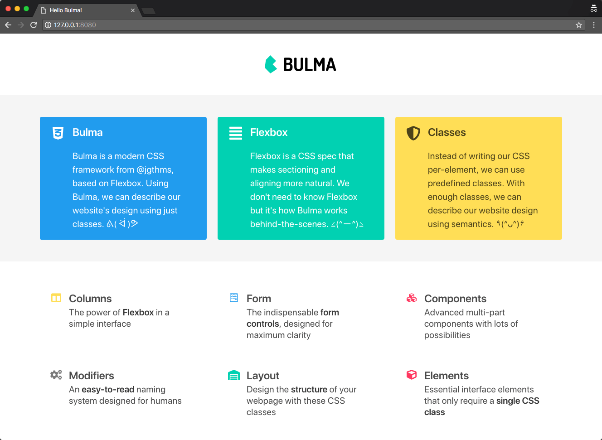

# Bulma

[Bulma](https://bulma.io/) 是一个轻量级的纯 CSS 框架，基于 FlexBox，相比 Bootstrap，没有 JavaScript 代码，更不用依赖 jQuery。所以在 React/Vue 这种不推荐使用 jQuery 的项目中，可以考虑使用。简单学习了解。

## 参考

1. [Documentation](https://bulma.io/documentation/)
1. [Video - Learn Bulma CSS for free](https://scrimba.com/g/gbulma)
1. [Video - Bulma CSS Framework Crash Course](https://www.youtube.com/watch?v=IiPQYQT2-wg)
1. [CSS 框架 Bulma 教程](http://www.ruanyifeng.com/blog/2017/10/bulma.html)

## Video - Learn Bulma CSS for free

这个 tutorial 还是需要你对 Bulma 有一些基本的了解才能吸引得比较好。

演示了三个 Demo：slide page，blog page，landing page。

这个 tutorial 还在案例中使用了 CSS Grid，可以说是比较 fashion 了。

学习到了一些常用的 classes：

关于布局：

1. hero / hero-head / hero-body / hero-footer
1. section / container
1. columns / column

关于颜色：

1. has-background-light
1. is-primary, is-warning, is-info

关于大小尺寸：

1. is-size-5, is-5 (暂不清楚二者区别)
1. is-fullheight
1. is-one-third
1. is-medium, is-large

关于文本：

1. title, subtitle
1. has-text-danger

关于 media：

1. media, media-left, media-content

还是需要把 Bulma 的文档整体再过一遍。

当使用 CSS Framework 时，得按照它们的规则来进行布局，比如 column class 必须得在 class 为 columns 的容器中使用，container class 一般在 class 为 section 的容器中使用。

最后的 Demo：

## Video - Bulma CSS Framework Crash Course

感觉这个视频教程比上一个还好一点，简洁明了地演示了常用功能的使用。

介绍了以下几大模块以及常用的 class。

- Heading / Size
  - .title, .subtitle
  - .is-1, .is-2, .is-3 ...

- Content
  - .content
  - .is-small, .is-medium, .is-large

- Button
  - .button
  - .is-white, .is-light, .is-black, .is-dark, .is-link
  - .is-primary, .is-info, .is-success, .is-warning, .is-danger
  - .is-outlined, .is-inverted
  - .is-hovered, .is-active, .is-focused. .is-loading

- Box
  - .box

- Notification
  - .notification
  - button.delete

- Tag
  - .tag

- Message
  - .message
  - .message-header, .message-body

- NavBar
  - .nav
  - .nav-left, .nav-center, .nav-right
  - .nav-item

- Side Menu
  - .menu
  - .menu-label, .menu-list

- Hero
  - .hero
  - .hero-header, .hero-body, .hero-footer

- Card
  - .card
  - .card-content, .card-footer
  - .card-footer-item

- Pagination
  - .pagination
  - .pagination-previous, .pagination-next
  - .pagination-list
  - .pagination-link
  - .is-current

- Level
  - .level
  - .level-left, .level-right
  - .level-item

- Form
  - .field, .has-addons
  - .control
  - label.label, .select, input.input

- Grid System
  - .columns
  - .column
  - is-2, is-8 ...
  - is-two-thirds, is-three-quarters ...

从上可知，is-1, is-2, is-8 ... 这类的 class，在不同的场景中有不同的意义，当它们和 title/subtitle 一起用时，这些 class 表示文本的尺寸，当它们和 column 一起用时，表示此例在整行中所占的比例。以 is-2 为例，即：

    .title.is-2 {
      font-size: 2.5rem;
    }

    .column.is-2 {
      flex: none;
      width: 16.66667%;
    }

而 .is-size-5 这类 class 则永远只用来表示文本尺寸。

最后的效果：

