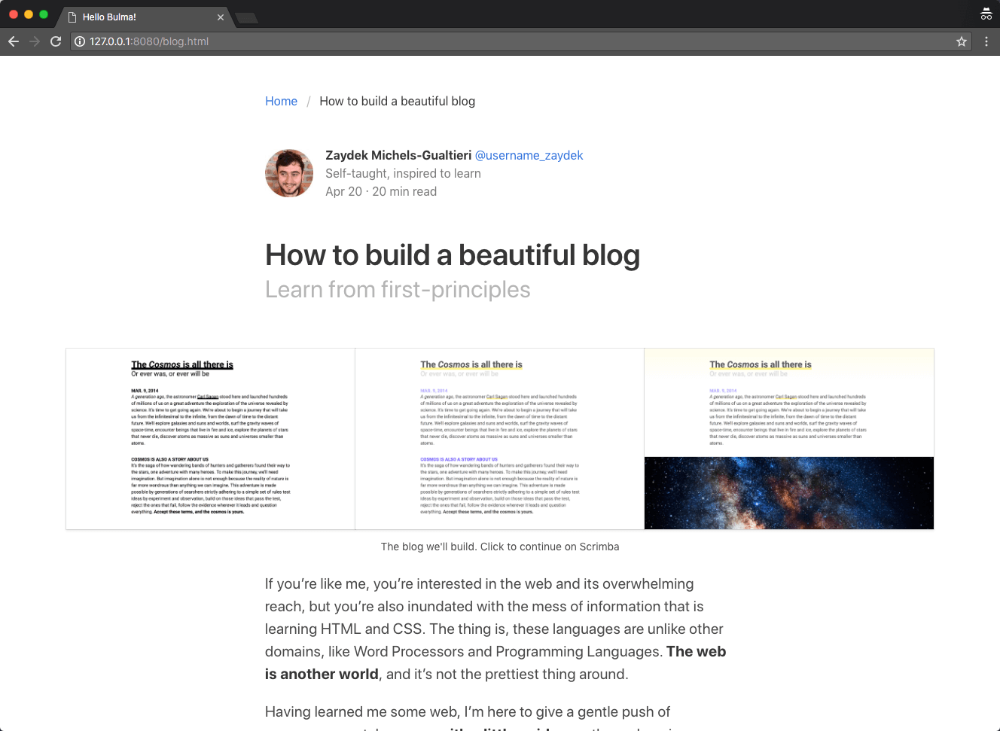

# Bulma

[Bulma](https://bulma.io/) 是一个轻量级的纯 CSS 框架，基于 FlexBox，相比 Bootstrap，没有 JavaScript 代码，更不用依赖 jQuery。所以在 React/Vue 这种不推荐使用 jQuery 的项目中，可以考虑使用。简单学习了解。

## 参考

1. [Documentation](https://bulma.io/documentation/)
1. [Video - Learn Bulma CSS for free](https://scrimba.com/g/gbulma)
1. [Video - Bulma CSS Framework Crash Course](https://www.youtube.com/watch?v=IiPQYQT2-wg)
1. [CSS 框架 Bulma 教程](http://www.ruanyifeng.com/blog/2017/10/bulma.html)

## Video - Learn Bulma CSS for free

这个 tutorial 还是需要你对 Bulma 有一些基本的了解才能吸引得比较好。

演示了三个 Demo：slide page，blog page，landing page。

这个 tutorial 还在案例中使用了 CSS Grid，可以说是比较 fashion 了。

学习到了一些常用的 classes：

关于布局：

1. hero / hero-head / hero-body / hero-footer
1. section / container
1. columns / column

关于颜色：

1. has-background-light
1. is-primary, is-warning, is-info

关于大小尺寸：

1. is-size-5, is-5 (暂不清楚二者区别)
1. is-fullheight
1. is-one-third
1. is-medium, is-large

关于文本：

1. title, subtitle
1. has-text-danger

关于 media：

1. media, media-left, media-content

还是需要把 Bulma 的文档整体再过一遍。

当使用 CSS Framework 时，得按照它们的规则来进行布局，比如 column class 必须得在 class 为 columns 的容器中使用，container class 一般在 class 为 section 的容器中使用。

最后的 Demo：

