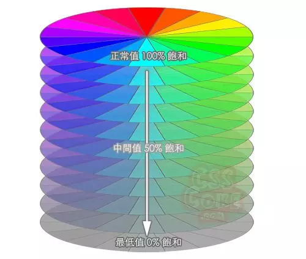

# Color

之前对于设计领域最大的困难在于配色，在于对颜色的理解，如果从面板中选中一个合适的颜色，如何将一个用 RGB 表示的值和实际的颜色对应上。

今天早上 (2019/06/19) 在微信公众号上看到这么一篇文章 - [【第 1644 期】RGB、HSL、Hex 网页色彩，看完这篇全懂了](https://mp.weixin.qq.com/s/5-XPFSv8mukCi6gNJTiNeA)，确实有点恍然大悟。(HSL 很早以前也看过，但当时没有理解，所以说知识不是看一遍就够的。)

原来 RGB 不直观是普遍的认识，它就是反人性，反直觉的，它只是对计算机友好的。

你想啊，总共就 3 种颜色，每种颜色分 256 个层级 (不知道这个层级到底意味着什么，是亮度吗? - 应该是的)，随便混一下，鬼知道混出来是什么颜色。

而 HSL (或者相似的 HSB) 则对人友好多了，HSL 分别表示 Hue (色相) / Saturation (饱和度) / Lightness (亮度 / 明度)。

> 因为我们对色彩的认识往往是 "什么颜色? 鲜艳不鲜艳? 亮还是暗?"。

H 色相控制颜色，其值为 0~360，每一个值就对应一个确定的颜色，常见的有 0 (红) / 60 (黄) / 120 (绿) / 180 (青) / 240 (蓝) / 300 (洋红? 可不可以理解成类似紫色?)，可以按彩虹的颜色来记 - 赤橙黄绿蓝靛紫。当你看到这个值的时候，你脑中就能大概知道这个颜色是什么样的，在色盘的哪个区域上。而不是 RGB，看到一堆十六进制的数字，完全懵逼。

S 控制饱和度 (我理解成灰度，鲜艳度)，从 0% ~ 100%，0% 是灰色，100% 是纯色。默认值应该是 100%。

(其实想想，灰色到底是个什么东西，该怎么理解灰色呢...)

L 控制亮度或明度 (理解成黑色和白色)，从 0% ~ 100%，0% 时纯黑 (可以用关灯来帮助理解)，表示亮度为 0，100% 纯白 (可以用开灯来帮助理解)，表示亮度为 100。默认值为 50%，表示亮度适中。话说在 RGB 中，我老是忘记到 00 和 FF，到底哪个表示全白，哪个表示全黑。完全可以用这里的 L 的值来理解，用 00 表示关灯，此时什么亮度都没有，所以是黑的，表示黑色，FF 表示开灯，全亮，所以算是白色的，表示白色。

大部分 (我想实际应该是所有吧) 设计软件的取色器都是用 HSL 或 HSB 表示的，因为对人更直观，以前看不懂这个取色器，现在明白了。HSL 可以换算成 RGB 方便在代码中使用。

以上所用图片皆来自以下参考链接。

## 参考

- [【第 1644 期】RGB、HSL、Hex 网页色彩，看完这篇全懂了](https://mp.weixin.qq.com/s/5-XPFSv8mukCi6gNJTiNeA)
- [色彩空间中的 HSL、HSV、HSB 有什么区别？](https://www.zhihu.com/question/22077462)
- [JS 实现 RGB，HSL，HSB 相互转换](https://syean.cn/2017/03/17/JS%E5%AE%9E%E7%8E%B0RGB-HSL-HSB%E7%9B%B8%E4%BA%92%E8%BD%AC%E6%8D%A2/)
