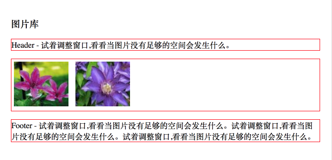
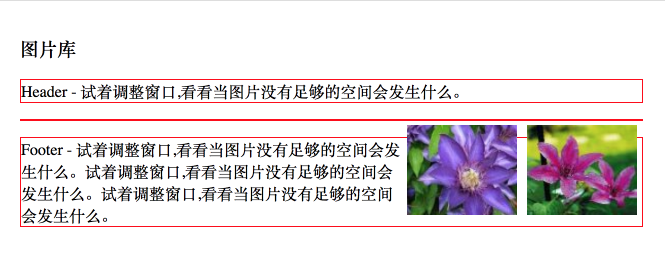
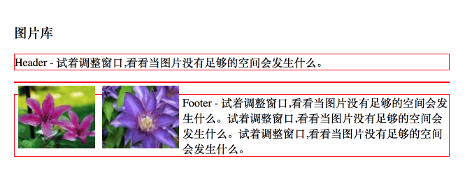
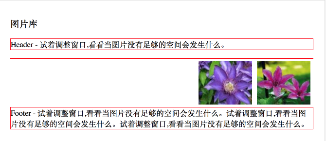
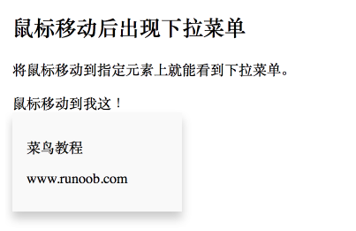

# CSS - Part 2

## CSS 定位 (Position)

position 属性指定了元素的定位类型。

position 属性的四个值：

- static
- fixed
- relative
- absolute

当指定 position 的值为 static 外的其它值时，可以通过 top, bottom, left, right 属性进一步指定它的具体位置。

**static**

HTML 元素的默认值，即没有定位，元素出现在正常的流中。

静态定位的元素不会受到 top, bottom, left, right 影响。

**fixed**

元素的位置相对于浏览器窗口是固定位置。即使窗口是滚动的它也不会移动：

    p.pos_fixed {
      position: fixed;
      top: 30px;
      right: 5px;
    }

**relative**

相对定位元素的定位是相对其正常位置。

    h2.pos_left {
      position: relative;
      left: -20px;
    }

可以移动的相对定位元素的内容和相互重叠的元素，它原本所占的空间不会改变。

相对定位元素经常被用来作为绝对定位元素的容器块。

**absolute**

absolute 和 fixed 类似，只不过 fixed 是相对整个浏览器保持位置不对，而 absolute 是相对它的最近的已定位的父元素 (注意修饰词，并不一定是直接父一级的元素)。

绝对定位的元素的位置相对于最近的已定位父元素，如果元素没有已定位的父元素，那么它的位置相对于 `<html>`。

    h2 {
      position: absolute;
      left: 100px;
      top: 150px;
    }

absolute 定位使元素的位置与文档流无关，因此不占据空间。

absolute 定位的元素和其他元素重叠。

**重叠的元素**

元素的定位与文档流无关，所以它们可以覆盖页面上的其它元素。

z-index 属性指定了一个元素的堆叠顺序 (哪个元素应该放在前面，或后面)，一个元素可以有正数或负数的堆叠顺序，具有更高堆叠顺序的元素总是在较低的堆叠顺序元素的前面。

    img {
      position: absolute;
      left: 0px;
      top: 0px;
      z-index: -1;
    }

**其它定位相关属性**

- clip - 裁剪
- cursor - 定义光标类型，最常见的值是 pointer
- overflow - 设置当元素的内容溢出其区域时该如何处理，常见的值有 hidden (直接隐藏)，scroll (显示滚动条)，visible (直接撑大区域)
- overflow-x
- overflow-y

## CSS 浮动 (Float)

(这一小节其实算是 CSS 中的一个难点，这里的介绍无疑是太简单了。)

正常的布局是从上到下，从左到右依次排列，但是如果我想让一个元素直接排列到页面的右边，就要借助 float 属性了。

float 的值：

- left
- right
- none

顾名思议，left 就是让元素浮动到左边，right 就是让元素浮动到右边。

将一个元素设置为浮动元素后，会影响它之后的元素布局，之前的不受影响。为了消除对后面元素的影响，可以对后面的第一个元素 (只需要第一个元素) 设置 `clear: both;` 的属性，这个设置是指定些元素两侧不能出现浮动元素。

简单的介绍就是这些。float 和 clear 是配合使用的。

下面通过一些例子来深入理解 float 的本质。浮动元素的本质是，它将脱离原来的文档布局，但又仍然占据空间，使后来的元素不会和它重叠。

    <head>
      
    </head>

    <body>
      <h3>图片库</h3>
      
Header - 试着调整窗口,看看当图片没有足够的空间会发生什么。

      

        
        
      

      
Footer - 试着调整窗口,看看当图片没有足够的空间会发生什么。试着调整窗口,看看当图片没有足够的空间会发生什么。试着调整窗口,看看当图片没有足够的空间会发生什么。

    </body>

运行结果：

如果将 ".thumbnail" 的 img 元素设置为 float 元素，我们假设为向右对齐：

    .thumbnail {
      float: right;
      width:110px;
      height:90px;
      margin:5px;
    }

运行结果：

如果 float 设为 left，则效果为：

从运行结果中可以看出，将 img 元素设置为 float 元素后，它们将从它的父元素 div 中脱离出来，变成浮动元素。div 的空间变成很小，不再包括 img 元素的空间。div 之后的 p 元素因此将直接显示在 div 元素之下。

但是，p 元素是块元素，理论上它应该是从行首开始显示的，而且要占据一整行，这样的话，它的内容将和图片的内容重叠，但从效果图上来看，无论 img 的 float 是 left 还是 right，它之后的 p 元素都没能占据一整行，也不见得是头行首开始显示。

这表示，float 元素仍然占据了布局空间，它之后的元素将环绕它进行布局，不管它是块元素还是行内元素。

这就是我所说的，float 元素，它脱离原有的文档，但又仍然占据空间，不会和像使用 fixed / absolute / relative 定位的元素那样和其它元素重叠。

所以，如果我们想让图片靠右对齐，又想让它之后的元素仍然像以前一样布局，而不是环绕图片，此例中，我们想让它之后的 p 元素仍然占据一整行空间，而且从行首开始显示，那么我们就给这个 p 元素设置 `clear: both;` 的属性。

    p.clear {
      clear: both;
    }

效果：

## CSS 布局 - 水平 & 垂直对齐

一些使用技巧。

**元素居中对齐**

使用 `margin: auto;`，并且要指定 width (比如 100%)，否则不起作用。

    .center {
      margin: auto;
      width: 50%;
      border: 3px solid green;
      padding: 10px;
    }

**文本居中对齐**

如果仅仅是为了文本在元素内居中对齐，可以使用 `text-align: center;`。

**图片居中对齐**

要让图片居中对齐, 可以使用 `margin: auto;`，并将它变成块元素中。(后者是关键，nice!)

    img {
        display: block;
        margin: auto;
        width: 40%;
    }

    <body>
      <h2>图片居中对齐</h2>
      
要让图片居中对齐, 可以使用 margin: auto; 并将它放到块元素中：

      
    </body>

**左右对齐 - 使用 position 方式**

我们可以使用 `position: absolute;` 属性来对齐元素。

    .right {
      position: absolute;
      right: 0px;
      width: 300px;
      border: 3px solid #73AD21;
      padding: 10px;
    }

绝对定位元素会被从正常流中删除，并且能够交叠元素。(与之对应的是 float 属性，它和绝对定位元素一样会从正常文档流中删除，但它不能重叠元素。)

**左右对齐 - 使用 float 方式**

我们也可以使用 float 属性来对齐元素。

    .right {
      float: right;
      width: 300px;
      border: 3px solid #73AD21;
      padding: 10px;
    }

**垂直居中 - 使用 padding**

    .center {
      padding: 70px 0;
      border: 3px solid green;
    }

上下各 padding 70px。

如果要水平和垂直都居中，可以使用 padding 和 `text-align: center;`。

    .center {
      padding: 70px 0;
      border: 3px solid green;
      text-align: center;
    }

**垂直居中 - 使用 line-height**

    .center {
      line-height: 200px;
      height: 200px;
      border: 3px solid green;
      text-align: center;
    }

    /* 如果文本有多行，添加以下代码: */
    .center p {
      line-height: 1.5;
      display: inline-block;
      vertical-align: middle;
    }

**垂直居中 - 使用 position 和 transform**

    .center {
      height: 200px;
      position: relative;
      border: 3px solid green;
    }

    .center p {
      margin: 0;
      position: absolute;
      top: 50%;
      left: 50%;
      transform: translate(-50%, -50%);
    }

## CSS 伪类 (Pseudo-classes) / 伪元素 (Pseudo-elements)

(重新整理，将原来的两小节合并成一个小节。)

两者在语法和使用上都非常相似，但实际上是有本质不同的。

语法：

    selector:pseudo-class {property:value;}
    selector:pseudo-element {property:value;}

伪元素也可以使用 "::" 替代 ":"，推荐还是使用单冒号。

也可以和类配合使用：

    selector.class:pseudo-class {...}
    selector.class:pseudo-element {...}

一个区分伪类和伪元素的笔记：

> **伪类**选择元素基于的是当前元素处于的状态，或者说元素当前所具有的特性，而不是元素的 id、class、属性等静态的标志。由于状态是动态变化的，所以一个元素达到一个特定状态时，它可能得到一个伪类的样式；当状态改变时，它又会失去这个样式。由此可以看出，它的功能和 class 有些类似，但它是基于文档之外的抽象，所以叫伪类。

> 与伪类针对特殊状态的元素不同的是，**伪元素**是对元素中的特定内容进行操作，它所操作的层次比伪类更深了一层，也因此它的动态性比伪类要低得多。实际上，设计伪元素的目的就是去选取诸如元素内容第一个字 (母)、第一行，选取某些内容前面或后面这种普通的选择器无法完成的工作。它控制的内容实际上和元素是相同的，但是它本身只是基于元素的抽象，并不存在于文档中，所以叫伪元素。

[总结伪类与伪元素](http://www.alloyteam.com/2016/05/summary-of-pseudo-classes-and-pseudo-elements/) 这篇文章也详细解释了它们的区别：

> 伪类的操作对象是文档树中已有的元素，而伪元素则创建了一个文档数外的元素。因此，伪类与伪元素的区别在于：有没有创建一个文档树之外的元素。

### 伪元素

伪元素的数量很少，忽略不常见的，常见的只有四个：

- before
- after
- first-letter
- first-line

**before**

before 伪元素可以在目标元素前面插入新内容，需要使用 content 属性来指定要插入的内容，被插入的内容实际并不在文档树中。

    h1:before {
      content: url(smiley.gif);
    }

上例表示在每个 h1 元素前插入一张图片。

after 同理。

**first-letter**

first-letter 伪元素用于向文本的首字母设置特殊样式，相当于新创建于一个 `` 元素，然后用它包围这个首字母，但这个 `` 元素并不在文档中。

**first-line**

first-line 伪元素用于向文本的首行设置特殊样式。同理 first-letter，相当于新创建了一个 `` 元素，然后用它包围第一行内容，但这个 `` 元素并不在文档中。

    p:first-line {
      color: #ff0000;
      font-variant: small-caps;
    }

first-line 只能用于块元素，不能用于行内元素。

### 伪类

伪类的数量比较多，上面的链接文章中把它按功能分成了几个大类：

- 状态相关
  - link
  - visited
  - hover
  - active
  - focus

- 结构化
  - not
  - first-child
  - last-child
  - first-of-type
  - last-of-type
  - nth-child(n)
  - nth-last-child(n)
  - nth-of-type(n)
  - nth-last-of-type(n)
  - only-child
  - only-of-type
  - target

- 表单相关
  - default
  - checked
  - disabled
  - enabled
  - empty
  - in-range
  - out-of-range
  - indeterminate
  - valid
  - invalid
  - optional
  - required
  - read-only
  - read-write
  - scope

- 语言相关
  - dir
  - lang(lang)

- 其它
  - root
  - fullscreen

具体使用见上面的链接文章。

## CSS 实战

### CSS 导航栏

分别一步步实现一个垂直和水平的导航栏，有点意思，详略，需要时再回来细看。

### 下拉菜单

wow, cool! 原来 hover 伪类不仅仅作用在 a 元素上，其实是可以作用在任何元素上的。

用到了绝对定位 absolute。

    <head>
      
    </head>

    <body>
      <h2>鼠标移动后出现下拉菜单</h2>
      
将鼠标移动到指定元素上就能看到下拉菜单。

      

        鼠标移动到我这！
        

          
菜鸟教程

          
www.runoob.com

        

      

    </body>

效果，当鼠标放在 span 元素上时，才显示下拉菜单，否则不显示。

### CSS 提示工具 (Tooltip)

nice! 和下拉菜单相似的原理，也用到了 hover 伪类和 absolute 绝对定位，还用到了 before/after 伪元素为 Tooltip 添加箭头。

### CSS 图片廊 (Gallery)

略。hover 伪类还真是好用呢。

### CSS 图像透明 / 不透明效果

使用 opacity 属性，为 1 时清晰，小于 1 时，越小越不清晰。

    img {opacity: 0.4;}
    img {opacity: 1.0;}

当用户将鼠标悬停在图片上时，图片是清晰的，移走时，图片变模糊。

### CSS 图片拼合技术

将多个图片拼合成一个，可以有效地降低对服务器的请求数量，节省带宽，提高网页加载速度。

使用示例：

    #home a:hover{background: url('img_navsprites_hover.gif') 0 -45px;}
    #prev a:hover{background: url('img_navsprites_hover.gif') -47px -45px;}
    #next a:hover{background: url('img_navsprites_hover.gif') -91px -45px;}

每个元素将显示同一张图片的不同部分的内容。

## CSS 媒体类型 (media)

媒体类型允许你指定文件将如何在不同媒体呈现。该文件可以以不同的方式显示在屏幕上，在纸张上，或听觉浏览器等等。

(比如 sans-serif 字体比较适合在屏幕上阅读，而 serif 字体更适合在纸上阅读。)

**@media 规则**

@media 规则允许在相同样式表为不同媒体设置不同的样式。

(实现响应式布局的关键)

在下面的例子告诉我们浏览器屏幕上显示一个 14 像素的 Verdana 字体样式。但是如果页面打印，将是 10 个像素的 Times 字体，而在两者上，字体都是粗体。

    

用 @media 实现响应式的用法：

    @media only screen and (max-width: 480px) {
      ...
    }

## CSS 总结

略。
