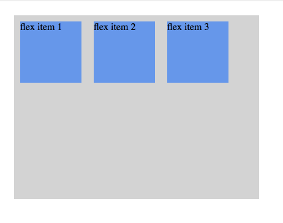
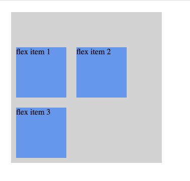

# CSS3

学习资源：

1. [CSS3 FlexBox](http://www.runoob.com/css3/css3-flexbox.html)

## CSS3 弹性盒子 (FlexBox)

相关的属性：

属性             | 说明
----------------|--------------------
display         | 指定 HTML 元素盒子类型，flex-box 的值为 "flex"
flex-direction  | 指定了弹性容器中子元素的排列方式 (其实是指定主轴的方向)
justify-content | 设置弹性盒子元素在主轴方向上的对齐方式
align-items     | 设置弹性盒子元素在侧轴方向上的对齐方式
align-self      | 在弹性子元素上使用，覆盖容器的 align-items 属性
flex-wrap       | 设置弹性盒子的子元素超出父容器时是否换行
align-content   | 修改 flex-wrap 属性的行为，类似 align-items，但不是设置子元素对齐，而是设置行对齐
flex-flow       | flex-direction 和 flex-wrap 的简写
order           | 设置弹性盒子的子元素排列顺序
flex            | 设置弹性盒子的子元素如何分配空间

(漏了 flex-grow, flex-shrink, flex-basis ?)

在设置为 flex-box 布局的元素中，传统的布局失效了，块元素和行内元素不再有意义。设置为 flex-box 布局的元素，只会影响到此元素和它的所有子元素，不会影响它之外的元素。

**主轴与侧轴**

暂略，在别的笔记中有解释。

**flex-direction**

指定主轴的方向。

四个值：

- row
- row-reverse
- column
- column-reverse

每个值的意义顾名思义，不多做解释。

**justify-content**

设置元素在主轴方向上的对齐方式。

值：

- flex-start
- flex-end
- center
- space-between
- space-around

**align-items**

设置元素在侧轴方向上的对齐方式。

值：

- flex-start
- flex-end
- center
- baseline
- stretch - 充满整个侧轴空间

对于子元素来说，其父元素的 align-items 的值可以被自身的 aligh-self 的值所覆盖。align-items 作用在容器元素，其指定的排列方式是针对它里面的子元素，其中的子元素可以通过指定自身的 align-self 属性来覆盖父元素的作用。

**flex-wrap**

指定子元素换行方式。

值：

- nowrap - 默认值，弹性容器为单行，该情况下子元素可能会溢出容器
- wrap - 弹性容器为多行，溢出的子元素会被放置到新行
- wrap-reverse - 同 wrap，但换行时从反方向开始排列

**align-content**

经过实践后，我的理解是，align-content 只有在子元素换行后才有作用，也就是它有几个前提条件：

- flex-wrap: wrap
- 子元素溢出并发生换行

这时，子元素有了多行，则 align-content 就是用来描述这些多行的对齐方式，是靠顶对齐，还是靠底对齐，还是居中对齐。

当 align-content 生效时，align-items 的值失效，相当于 align-content 具有更高优先高。

比如下面这个例子：

    <head>
      
    </head>

    <body>
      

        
flex item 1

        
flex item 2

        
flex item 3

      

    </body>

当子元素没有发生换行时，align-items 是生效的，此时它们靠顶端对齐。

然后我们把父容器的宽度缩小为 300px，让子元素发生换行，这时，align-content 开始生效，子元素变成靠底端对齐。

    .flex-container {
      ...
      width: 300px;
    }

align-content 的值，和 align-items 的值基本相同：

- stretch - 默认，各行将会伸展以占用剩余的空间
- flex-start - 各行向弹性盒容器的起始位置堆叠
- flex-end - 各行向弹性盒容器的结束位置堆叠
- center -各行向弹性盒容器的中间位置堆叠
- space-between -各行在弹性盒容器中平均分布
- space-around - 各行在弹性盒容器中平均分布，两端保留子元素与子元素之间间距大小的一半

**order**

可以通过数值重新指定元素在父元素中的顺序，数值小的排在前面。类似 z-index 属性啦，详略。

**flex**

语法：

    flex: flex-grow flex-shrink flex-basis

flex-box 就剩这个难点我一直没有很好的理解，尤其是后面两个值的意义... 结果这里一带而过，只好再看其它资料补充了。

- flex-grow - 定义弹性盒子元素的扩展比率
- flex-shrink - 定义弹性盒子元素的收缩比率
- flex-basis - 定义弹性盒子元素的默认基准值
