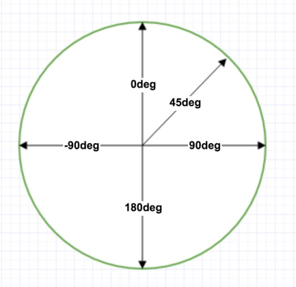

# CSS3

## CSS3 简介

### CSS3 模块

CSS3 被拆分为 "模块"。旧规范已拆分成小块，还增加了新的。

一些最重要 CSS3 模块如下：

- 选择器
- 盒模型
- 背景和边框
- 文字特效
- 2D/3D 转换
- 动画
- 多列布局
- 用户界面

## CSS3 边框

CSS3 可以创建圆角边框，添加阴影框，并使用边框图片。(在 CSS3 之前如果想实现圆角边框，必须用图片背景模拟。)

CSS3 关于边框的新增属性：

- border-radius
- box-shadow
- border-image

**border-radius**

在 CSS3 中 border-radius 属性被用于创建圆角。

    div {
      border: 2px solid;
      border-radius: 25px;
    }

可以单独指定某个方向的圆角：

- border-top-left-radius
- border-top-right-radius
- border-bottom-right-radius
- border-bottom-left-radius

**box-shadow**

CSS3 中的 box-shadow 属性被用来添加阴影。

    div {
      box-shadow: 10px 10px 5px #888888;
    }

**border-image**

border-image 属性允许你指定一个图片作为边框。

    div {
      border-image: url(border.png) 30 30 round;
    }

## CSS3 背景

CSS3 中包含几个新的背景属性，提供更大背景元素控制。

- background-image
- background-size
- background-origin
- background-clip

CSS3 支持多重背景图像。

**background-image**

CSS3 的 background-image 支持多重背景图像，不同的背景图片用逗号隔开，第一张显示在最顶端。

    #example1 {
      background-image: url(img_flwr.gif), url(paper.gif);
      background-position: right bottom, left top;
      background-repeat: no-repeat, repeat;
    }

    #example1 {
        background: url(img_flwr.gif) right bottom no-repeat, url(paper.gif) left top repeat;
    }

**background-size**

background-size 指定背景图像的大小。CSS3 以前，背景图像大小由图像的实际大小决定。

指定具体的值：

    div {
      background: url(img_flwr.gif);
      background-size: 80px 60px;
      background-repeat: no-repeat;
    }

指定百分比：

    div {
      background: url(img_flwr.gif);
      background-size: 100% 100%;
      background-repeat: no-repeat;
    }

**background-origin**

background-origin 属性指定了背景图像的位置区域，有三个值：

- content-box - 背景只布置在 content-box 范围内
- padding-box
- border-box

示例：

    div {
      background: url(img_flwr.gif);
      background-repeat: no-repeat;
      background-size: 100% 100%;
      background-origin: content-box;
    }

**background-clip**

background-clip 背景剪裁属性是从指定位置开始绘制。

~~其实和 background-origin 是相似的作用，只不过 background-origin 是指定背景图像的位置区域，而 background-clip 是指定背景颜色的位置区域，也是三个值：content-box, padding-box, border-box。~~ no, no, no, 并不是这样的。搜索了一些资料后明白了 background-origin 和 background-clip 的真正区别，它们是不一样作用的。

最简单地来说，最终显示的背景，是这两个属性的值作用后产生的交集。

background-origin 只是定义背景图片从何处开始放置，但最终渲染的时候，从哪里开始渲染，却是由 background-clip 的值来决定的。

举例来说，假如 background-origin 的值是 border-box，而 background-clip 的值是 content-box，那么背景图片的左上角是和元素边框的左上角对齐，但实际开始渲染的时候，图片只有 content-box 内的部分会被渲染出来，padding 和 border 的图片部分被裁剪掉了。

## CSS3 渐变 (Gradients)

CSS3 渐变可以让你在两个或多个指定的颜色之间显示平稳的过渡，在此之前是用图片模拟实现的。

CSS3 定义了两种类型的渐变：

- 线性渐变 (Linear Gradients) - 向下/向上/向左/向右/对角方向
- 径向渐变 (Radial Gradients) - 由它们的中心定义

### 线性渐变 - Linear Gradients

为了创建一个线性渐变，你必须至少定义两种颜色结点。颜色结点即你想要呈现平稳过渡的颜色。同时，你也可以设置一个起点和一个方向 (或一个角度)。

语法：

    {background: linear-gradient(direction|angle, color-stop1, color-stop2, ...);}

所以，这里面至少包含两个要素：

1. 指定方向或角度
1. 指定颜色

**方向**

方向可以省略，默认值是从上到下。

    #grad {
      background: linear-gradient(red, blue);
    }

其它的方向：

- 从左到右

        #grad {
          background: linear-gradient(to right, red, blue);
        }

- 对角，从左上角到右下角

        #grad {
          background: linear-gradient(to bottom right, red , blue);
        }

可见，关键是一个 "to" 字，指定目标方向。

**角度**

同时，还可以用角度值来指定方向。

角度是指水平线和渐变线之间的角度，逆时针方向计算。换句话说，0deg 将创建一个从下到上的渐变，90deg 将创建一个从左到右的渐变。

注意，这个值有兼容性问题，有些浏览器默认 0deg 是从左向右 (我觉得确实这样合理一些啊...)

用角度来实现的从上到下：

    #grad {
      background: linear-gradient(180deg, red, blue);
    }

**颜色**

包括两部分内容：

- 颜色的数量：至少两个，一个起点，一个终点，可以多于两个，中间的值作为过渡色
- 颜色的值：和所有 color 属性一样，接受十六进制 #ff0000，`rgb(255,0,0)`，预定义颜色词 red/blue 三类，另外还接受使用透明度的 `rgba(255,0,0,0.5)`

彩虹：

    #grad {
      background: linear-gradient(to right, red, orange, yellow, green, blue, indigo, violet);
    }

**重复的线性渐变**

`repeating-linear-gradient()` 函数用于重复线性渐变。

    #grad {
      background: repeating-linear-gradient(red, yellow 10%, green 20%);
    }

### 径向渐变 - Radial Gradients

径向渐变由中心往外渐变。

语法：

    {background: radial-gradient(center, shape size, start-color, ..., last-color);}

这里面包含几个要素：

1. 指定中心位置。默认是在中心，center。
1. 指定渐变的形状，可以是圆形，椭圆等，默认是椭圆 ellipse。
1. 指定渐变的大小，默认是 farthest-corner (表示到最远的角落)。

示例：

- 指定形状为圆形

        #grad {
          background: radial-gradient(circle, red, yellow, green);
        }

- 指定中心位置和大小

        #grad1 {
          background: radial-gradient(60% 55%, closest-side,blue,green,yellow,black);
        }

(那么，中心位置、形状、大小如何共存呢?)

**重复的径向渐变**

`repeating-radial-gradient()` 函数用于重复径向渐变。

    #grad {
      background: repeating-radial-gradient(red, yellow 10%, green 15%);
    }

(百分数是啥意思?)

## CSS3 文本效果

新增属性：

- text-shadow
- box-shadow
- text-overflow
- word-wrap
- word-break

**text-shadow**

为文本增加阴影，可以指定水平阴影，垂直阴影，模糊的距离，以及阴影的颜色。

    h1 {
      text-shadow: 5px 5px 5px #FF0000;
    }

**box-shadow**

为盒子增加水平、垂直阴影。

    div {
      box-shadow: 10px 10px 5px #888888;
    }

可以指定多个 shadow? 为什么下面的例子中有 5 参数?

    div.card {
      width: 250px;
      box-shadow: 0 4px 8px 0 rgba(0, 0, 0, 0.2), 0 6px 20px 0 rgba(0, 0, 0, 0.19);
      text-align: center;
    }

**text-overflow**

指定如何显示溢出的文本内容。比如说一个 p 元素，指定它的宽度是 20px，但它里面的文本内容可能达到了 40px。超过的 20px 的该如何显示。

有几种值：

- clip - 默认，直接裁剪掉
- ellipsis - 显示省略号 "..."
- string - 使用给定的字符串来代表被裁剪掉的文本，比如 "more"

**word-wrap**

如果某个单词太长，不适合在一个区域内，它扩展到外面。CSS3 的自动换行属性允许您强制文本换行，即使这意味着分裂它中间的一个字。

    p {word-wrap:break-word;}

**word-break**

CSS3 单词拆分换行属性指定换行规则，有两个值：

- keep-all - 只能在半角空格或连字符处换行
- break-all - 允许在单词内换行

(不是很懂，和 word-wrap 的区别?)

**其它新增属性**

略。不是很重要，需要时再看手册吧。

## CSS3 字体

CSS3 之前，如果网页使用了一些特殊字体，用户不得不在自己电脑上手动安装这种字体才能正确渲染。

在 CSS3 中，网页可以包含这些特殊字体，它会自动下载给需要的用户 (意思是说，如果电脑上已经安装了，就不会下载)。

在 CSS3 中，使用 @font-face 来描述自定义的特殊字体的名字，下载路径等信息。(@font-face 让我想起了 @media)

    

在 @font-face 的属性中，font-family 和 src 是必需要，还支持其它的可选属性：

- font-style
- font-weight
- font-stretch
- unicode-range

## CSS3 2D 转换

transform 属性，对元素进行位移、旋转、缩放、斜切、矩阵变换，相应的方法如下：

- translate(x, y) - 还包括 translateX(x), translateY(y)
- rotate(angle)
- scale(x,y) - 还包括 scaleX(x), scaleY(y)
- skew(x,y) - 还包括 skewX(x), skewY(y)
- matrix(n1,n2,n3,n4,n5,n6) - 实际是上面四个方法的汇总，上面四个方法的内部是通过 matrix() 方法实现的

详略，在 Android 中已经有了很多了解。无论哪个框架，涉及到 UI 元素，都有这样的变换。

简单示例：

    div {
      transform: translate(50px, 100px);
    }
    div {
      transform: rotate(30deg);
    }
    div {
      transform: scale(2, 3);
    }
    div {
      transform: skew(30deg, 20deg);
    }

**martix() 方法**

martix() 方法是上面所有变换实现的真正方法，translate / roate / scale / skew 不过是对 matrix 的一层封装。

matrix() 方法有六个参数，包含旋转，缩放，移动 (平移) 和倾斜功能。

利用 matrix() 方法旋转 div 元素30°：

    div {
      transform: matrix(0.866,0.5,-0.5,0.866,0,0);
    }

## CSS3 3D 变换

在前面的 CSS3 2D 变换中，仅包含 X 轴和 Y 轴的变换，如果再加上 Z 轴的变换，那就是 3D 变换了。

所以它相比 2D 变换，仅仅是增加对 Z 轴进行变换的方法 (表面上看是这样的)：

- matrix3d(n,n,n,n,n,n,n,n,n,n,n,n,n,n,n,n) - 定义 3D 转换，使用 16 个值的 4x4 矩阵

- translate3d(x,y,z) - 定义 3D 位移
  - translateX(x) - 定义 3D 位移，仅使用用于 X 轴的值
  - translateY(y) - 定义 3D 位移，仅使用用于 Y 轴的值
  - translateZ(z) - 定义 3D 位移，仅使用用于 Z 轴的值

- scale3d(x,y,z) - 定义 3D 缩放
  - scaleX(x) - 定义 3D 缩放，通过给定一个 X 轴的值
  - scaleY(y) - 定义 3D 缩放，通过给定一个 Y 轴的值
  - scaleZ(z) - 定义 3D 缩放，通过给定一个 Z 轴的值

- rotate3d(x,y,z,angle) - 定义 3D 旋转
  - rotateX(angle) - 定义沿 X 轴的 3D 旋转
  - rotateY(angle) - 定义沿 Y 轴的 3D 旋转
  - rotateZ(angle) - 定义沿 Z 轴的 3D 旋转

- perspective(n) - 定义 3D 转换元素的透视视图

skew() 方法没有 z 轴的变换。

另外在 2D 变换中，只有 rotate(angle) 一个方法，没有 rotateX() 和 rotateY()。2D 的 rotate 和 3D 的 rotate 是完全不一样的。

## CSS3 过渡 (Transition)

当某个属性的值发生变化时，可以使用过渡来使用它的变化平缓，而不是突变，相当于产生了一种动画。在 CSS3 之前，需要借助 Flash 动画或 JavaScript 实现。

举例说明：

  div {
    width: 100px;
    height: 100px;
    background: red;
  }
  div:hover {
    width: 300px;
  }

上面例子中实现的效果，当鼠标移动到一个 100x100 的红色块元素上时，这个红色块元素的宽度会突然变成 300px，鼠标移开后，重新变回 100px，这个变化是突然的，瞬间的。

我们想让这个变化是平缓的，缓慢的变长或变短，我们给 div 加上 transition 属性：

  div {
    width: 100px;
    height: 100px;
    background: red;
    transition: width 2s;
  }
  div:hover {
    width: 300px;
  }

`transition: width 2s;` 的作用是，监听 width 属性的变化，如果发生变生，那么让它的变化在 2s 内完成，而不是瞬间完成。

这其实增加了一个监听器，或者是一种勾子。

transition 的完整语法：

    transition: transition-property transition-duration transition-timing-function transtion-delay;

- transition-property - 规定应用过渡的 CSS 属性的名称
- transition-duration - 定义过渡效果花费的时间，默认是 0
- transition-timing-function - 规定过渡效果的时间曲线，默认是 "ease"
- transition-delay - 规定过渡效果何时开始，默认是 0
- transition - 上述属性的汇总使用

前四个属性是可以单独使用的。

示例：

    div {
      transition: width 1s linear 2s;
    }

等同于：

    div {
      transition-property: width;
      transition-duration: 1s;
      transition-timing-function: linear;
      transition-delay: 2s;
    }

在同一条 transition 语句中支持同时监听多个属性的变化，用逗号隔开：

    div {
      transition: width 2s, height 2s, transform 2s;
    }

(总感觉 CSS 在做越来越多本该是由 DOM API 应该做的事情啊...)

## CSS3 动画

CSS3，我们可以创建动画，它可以取代许多网页动画图像，比如 Flash 动画和 JavaScript 动画。

使用 @keyframes 定义一个样式属性的变化过程，然后用 animation 属性把它应用到某个元素上。(类似 @font-face 和 font-family 的使用。)

    @keyframes myfirst {
      from {background: red;}
      to {background: yellow;}
    }

    div {
      animation: myfirst 5s;
    }

上面的例子表示，div 元素在动画开始的时候背景是红色，在结束的时候 (第 5s 的时候) 是黄色，中间的插值颜色由系统自动补充。

不光可以用 "from" 和 "to" 指定阶段，还可以用百分比，实际上 "from" 等于 0%，"to" 等于 100%。

    @keyframes myfirst {
      0%   {background: red;}
      25%  {background: yellow;}
      50%  {background: blue;}
      100% {background: green;}
    }

@keyframes，顾义思议，关键帧，它的内容很纯粹，只是定义了一些关键时刻各个属性的值。animation 才是真正的执行动画。

animation 相关的属性：

- animation - 所有动画属性的简写属性，除了 animation-play-state 属性
- animation-name - 规定 @keyframes 动画的名称
- animation-duration - 规定动画完成一个周期所花费的秒或毫秒，默认是 0
- animation-timing-function - 规定动画的速度曲线，默认是 "ease"
- animation-delay - 规定动画何时开始，默认是 0
- animation-iteration-count - 规定动画被播放的次数，默认是 1
- animation-direction - 规定动画是否在下一周期逆向地播放，默认是 "normal"
- animation-play-state - 规定动画是否正在运行或暂停，默认是 "running"

示例：

    div {
      animation-name: myfirst;
      animation-duration: 5s;
      animation-timing-function: linear;
      animation-delay: 2s;
      animation-iteration-count: infinite;
      animation-direction: alternate;
      animation-play-state: running;
    }

等同于：

    div {
      animation: myfirst 5s linear 2s infinite alternate;
    }

## CSS3 多列

(这个功能第一次听说。有人用过吗? 是不是有了 FlexBox 之后这种类似的属性就没有用武之地了?)

CSS3 可以将文本内容设计成像报纸一样的多列布局。

相关的属性：

- columns
  - column-count
  - column-width
- column-gap
- column-rule
  - column-rule-style
  - column-rule-width
  - column-rule-color
- column-span

详略。看着是蛮有意思，等需要时再回来细看。

## CSS3 用户界面

在 CSS3 中，增加了一些新的用户界面特性来调整元素尺寸，框尺寸和外边框。

相关的属性：

- resize - none, both, horizontal, vertical
- box-sizing - border-box, content-box
- outline-offset
- nav-left / nav-right / nav-up / nav-down / nav-index
- icon
- appearance

resize 表示是否允许用户自己调整某个元素的宽高。

这些属性里最有用的算是 box-sizing 这个属性了，我们可以通过它把盒模型从传统的 content-box 切换到 border-box。

## CSS3 实战

### CSS3 图片

CSS3 图片的各种应用，包括圆角、缩略图、响应式图片、图片文本、卡片式图片、图片滤镜、响应式图片相册、图片 Modal。

图片滤镜的实现是通过 filter 属性下的各种滤镜效果方法，有意思。

详略。

### CSS3 按钮

现代化按钮的实现：

    .button {
      background-color: #4CAF50; /* Green */
      border: none;
      color: white;
      padding: 15px 32px;
      text-align: center;
      text-decoration: none;
      display: inline-block;
      font-size: 16px;
    }

这一小节实现的按钮效果都超赞的，需要做按钮时回来参考。

很多地方都用到了 inline-block，但这里都没有讲到它。

### CSS3 分页

实现各种分页效果，nice~! 详略。

## CSS3 弹性盒子 (FlexBox)

略，单独写到一篇笔记中。

## CSS3 多媒体查询 (@media)

CSS2 时代移动设备还没有普及，因此，等到移动设备普及后，原来 @media 对移动设备的支持就不够友好了。

CSS3 的多媒体查询继承了 CSS2 多媒体类型的所有思想：取代了查找设备的类型，CSS3 根据设置自适应显示。(?? 说的啥于玩意)

媒体查询可用于检测很多事情，例如：

- viewport (视窗) 的宽度与高度
- 设备的宽度与高度
- 朝向 (智能手机横屏，竖屏)
- 分辨率

语法：

    @media not|only mediatype and (expressions) {
      CSS 代码...;
    }

media 还可以直接作用在 `<link>` 标签上 (但估计没有这么做吧...)

    <link rel="stylesheet" media="mediatype and|not|only (expressions)" href="print.css">

用 @media 实现响应式的示例：

    @media screen and (min-width: 480px) {
      #leftsidebar {width: 200px; float: left;}
      #main {margin-left:216px;}
    }

    @media screen and (max-width: 699px) and (min-width: 520px), (min-width: 1151px) {
      ul li a {
        padding-left: 30px;
        background: url(email-icon.png) left center no-repeat;
      }
    }

## CSS3 总结

漏掉没讲到的知识点：inline-block

没有的教程：css-grid
